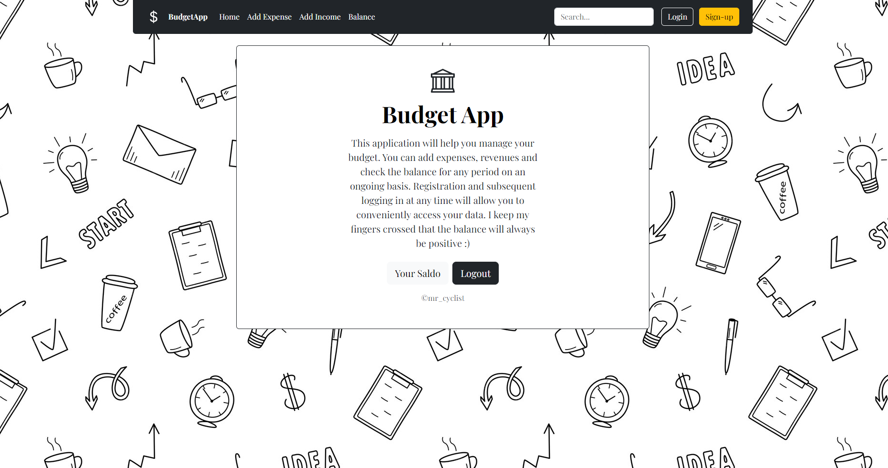
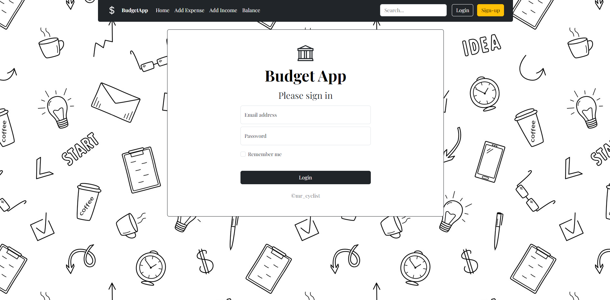
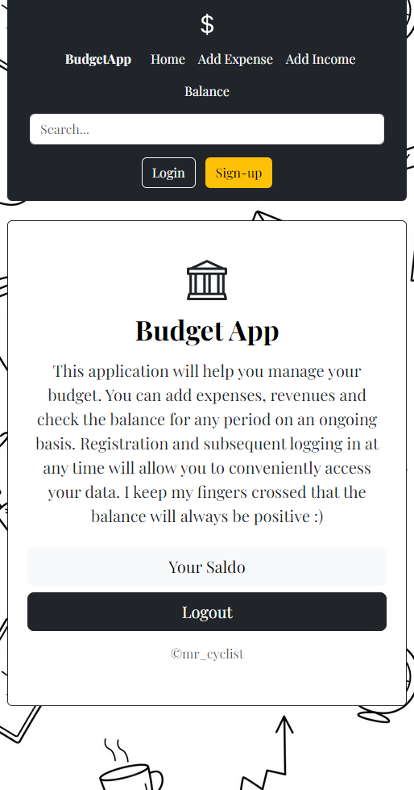
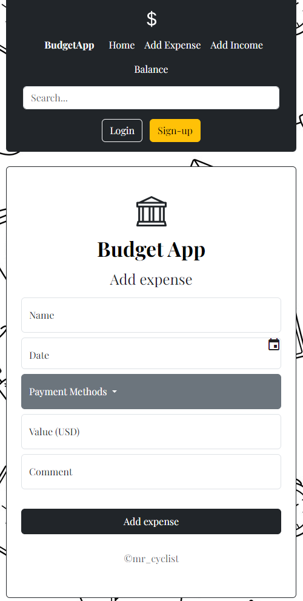
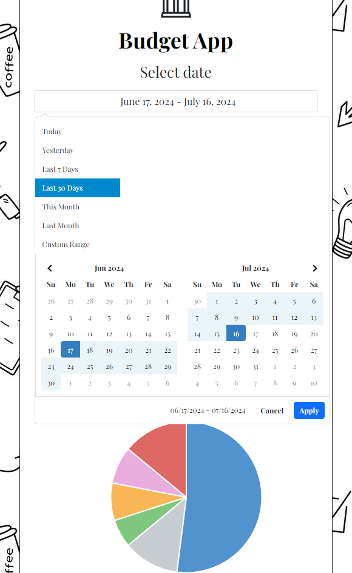
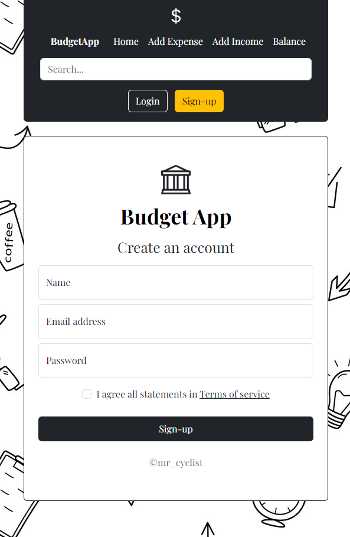

# Budget App

# Project Name
- This application will help you manage your budget. You can add expenses, revenues and check the balance for any period on an  ongoing basis. Registration and subsequent logging in at any time will allow you to conveniently access your data. I keep my fingers crossed that the balance will always be positive :)

## Table of Contents
* [General Info](#general-information)
* [Technologies Used](#technologies-used)
* [Features](#features)
* [Screenshots](#screenshots)
* [Acknowledgements](#acknowledgements)
* [Contact](#contact)

## General Information
- This is my first solution of Boostrap. An excellent exercise in combining HTML, CSS and its add-ons like Bootstrap Not forgetting about responsiveness. Database SQL and backend PHP will allow all functionalities to function properly and be saved and restored in the later operation of the application, with access to them at any time.

## Technologies Used
- HTML5 Markup
- CSS 
- Flexbox
- Grid
- Bootstrap
- RWD - Responsive Web Design 
- JavaScript
- Database SQL
- PHP 

## Features
List the ready features here:
- Bootstrap

## Screenshots

## Acknowledgements
- This project was based on default perosnal websites using Bootstrap.

## Contact
Created by [@mr_cyclist] - contact me!
